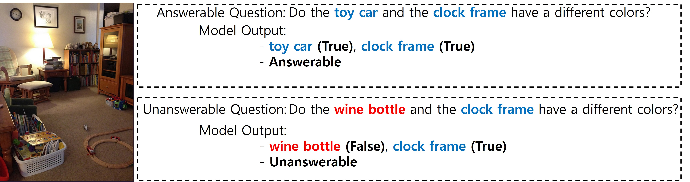

# Answerability Reasoning in VQA

<!-- ABOUT THE PROJECT -->
## About The Project

Visual Question Answering (VQA) is the task of answering a question about an image. Evaluating if the posed question is relevant to the input image has gained some attention because of the models' reliability when applied in real-life situations. However, previous approaches have not focused on reasoning about why a question is relevant/irrelevant to the given image. In this project, we develop a method that reasons the answerability of the question given an image. 


<p align="right">(<a href="#readme-top">back to top</a>)</p>


<!-- Usage -->
## Usage

This is an example of how you may give instructions on setting up your project locally.
To get a local copy up and running follow these simple example steps.


### 0. Dependencies

create a conda environment from `requirements.txt` file.


  ```sh
  conda create --name ENV_NAME --file requirements.txt
  ```

<p align="right">(<a href="#readme-top">back to top</a>)</p>

### 1. Downlaod Dataset
Download scene graphs raw data from: https://nlp.stanford.edu/data/gqa/sceneGraphs.zip

Download questions raw data from: https://nlp.stanford.edu/data/gqa/questions1.2.zip

Put sceneGraph files: `train_sceneGraphs.json` and `val_sceneGraphs.json` into `gqa_data/`

Put questions json files: `train_balanced_questions.json` and `val_balanced_questions.json` into `gqa_data/`

After this step, the data file structure should look like this:

```sh
LBA-ARVQA
   gqa_data/
      train_sceneGraphs.json
      val_sceneGraphs.json
      train_balanced_questions.json
      val_balanced_questions.json
   object_list_extraction.py
   dataset_creation.py
   main.py
```

### 2. Object List Extracting from Questions
Following commands should run without error:
```sh
python object_list_extraction.py
```

### 3. Dataset augmentation to train the reasoning model
Following commands should run without error:
```sh
python dataset_creation.py
```

### 4. Training
For now, we only have single GPU training:
```sh
CUDA_VISIBLE_DEVICES=0 python main.py
```


<!-- CONTRIBUTING -->
## Contributing

Contributions are what make the open source community such an amazing place to learn, inspire, and create. Any contributions you make are **greatly appreciated**.

If you have a suggestion that would make this better, please fork the repo and create a pull request. You can also simply open an issue with the tag "enhancement".
Don't forget to give the project a star! Thanks again!

1. Fork the Project
2. Create your Feature Branch (`git checkout -b feature/AmazingFeature`)
3. Commit your Changes (`git commit -m 'Add some AmazingFeature'`)
4. Push to the Branch (`git push origin feature/AmazingFeature`)
5. Open a Pull Request

<p align="right">(<a href="#readme-top">back to top</a>)</p>


LICENSE
## License

Distributed under the MIT License. See `LICENSE.txt` for more information.

<p align="right">(<a href="#readme-top">back to top</a>)</p>


<!-- CONTACT -->
## Contact

Hee Suk Yoon - hskyoon@kaist.ac.kr

Project Link: [https://github.com/tomyoon2/VQRR](https://github.com/tomyoon2/VQRR)

<p align="right">(<a href="#readme-top">back to top</a>)</p>


<!-- ACKNOWLEDGMENTS -->
## Acknowledgments

This work was supported by Institute of Information & communications Technology Planning & Evaluation (IITP) grant funded by the Korea government(MSIT) (No. 2022-0-00951, Development of Uncertainty-Aware Agents Learning by Asking Questions)

<p align="right">(<a href="#readme-top">back to top</a>)</p>


<!-- MARKDOWN LINKS & IMAGES -->
<!-- https://www.markdownguide.org/basic-syntax/#reference-style-links -->
[contributors-shield]: https://img.shields.io/github/contributors/github_username/repo_name.svg?style=for-the-badge
[contributors-url]: https://github.com/github_username/repo_name/graphs/contributors
[forks-shield]: https://img.shields.io/github/forks/github_username/repo_name.svg?style=for-the-badge
[forks-url]: https://github.com/github_username/repo_name/network/members
[stars-shield]: https://img.shields.io/github/stars/github_username/repo_name.svg?style=for-the-badge
[stars-url]: https://github.com/github_username/repo_name/stargazers
[issues-shield]: https://img.shields.io/github/issues/github_username/repo_name.svg?style=for-the-badge
[issues-url]: https://github.com/github_username/repo_name/issues
[license-shield]: https://img.shields.io/github/license/github_username/repo_name.svg?style=for-the-badge
[license-url]: https://github.com/github_username/repo_name/blob/master/LICENSE.txt
[linkedin-shield]: https://img.shields.io/badge/-LinkedIn-black.svg?style=for-the-badge&logo=linkedin&colorB=555
[linkedin-url]: https://linkedin.com/in/linkedin_username
[product-screenshot]: images/screenshot.png
[Next.js]: https://img.shields.io/badge/next.js-000000?style=for-the-badge&logo=nextdotjs&logoColor=white
[Next-url]: https://nextjs.org/
[React.js]: https://img.shields.io/badge/React-20232A?style=for-the-badge&logo=react&logoColor=61DAFB
[React-url]: https://reactjs.org/
[Vue.js]: https://img.shields.io/badge/Vue.js-35495E?style=for-the-badge&logo=vuedotjs&logoColor=4FC08D
[Vue-url]: https://vuejs.org/
[Angular.io]: https://img.shields.io/badge/Angular-DD0031?style=for-the-badge&logo=angular&logoColor=white
[Angular-url]: https://angular.io/
[Svelte.dev]: https://img.shields.io/badge/Svelte-4A4A55?style=for-the-badge&logo=svelte&logoColor=FF3E00
[Svelte-url]: https://svelte.dev/
[Laravel.com]: https://img.shields.io/badge/Laravel-FF2D20?style=for-the-badge&logo=laravel&logoColor=white
[Laravel-url]: https://laravel.com
[Bootstrap.com]: https://img.shields.io/badge/Bootstrap-563D7C?style=for-the-badge&logo=bootstrap&logoColor=white
[Bootstrap-url]: https://getbootstrap.com
[JQuery.com]: https://img.shields.io/badge/jQuery-0769AD?style=for-the-badge&logo=jquery&logoColor=white
[JQuery-url]: https://jquery.com 

